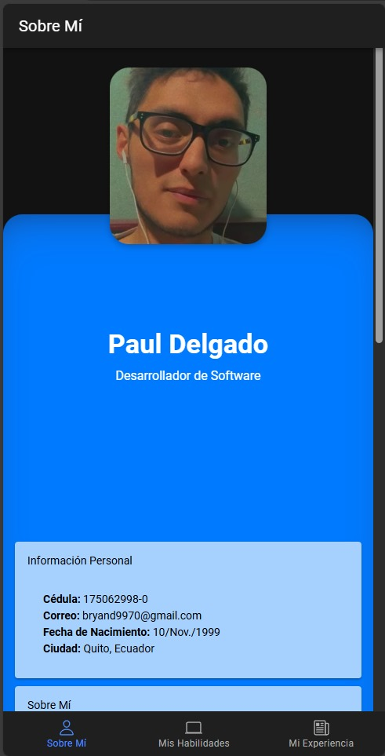
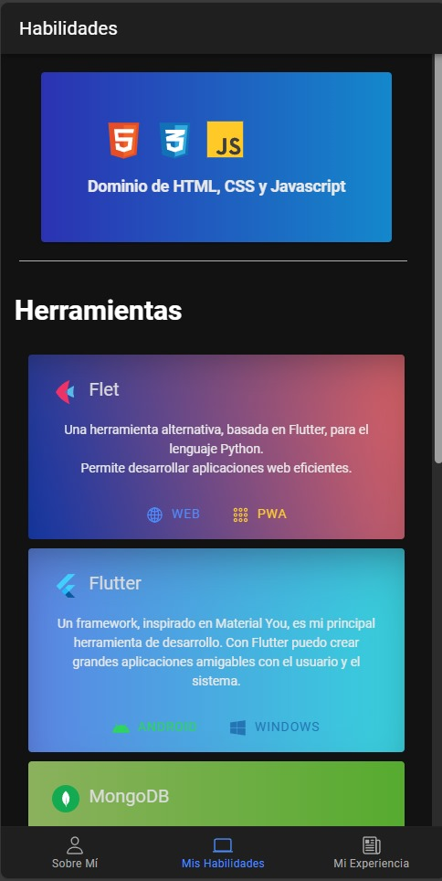

# 🔥 CV_Firebase

Aplicación de hoja de vida (CV) + Firebase Hosting + infinite scrolling

La aplicación cuenta con el CV de uno de unos integrantes:

- [@bryandelgado99](https://github.com/bryandelgado99)

## 💻 Tecnologías

**Cliente:** Ionic - Angular

**Servidor:** Firebase

[](https://skillicons.dev)

## Instalación

Para instalar el proyecto

```bash
  npm install my-project
  cd my-project
```

Usando ionic correr el servidor

```bash
  ionic serve
```

Ademas contamos con el APK del projecto para usarlo en móviles

## 🖼️ Screenshots

- Pantalla Principal
  

- Pantalla Secundaria
  

## 👫 Autores

- [@bryandelgado99](https://github.com/bryandelgado99)
- [@Mino-Mateo](https://github.com/Mino-Mateo)
- [@natycasillas](https://github.com/natycasillas)
- [@DannyYanacallo1755](https://github.com/DannyYanacallo1755)
