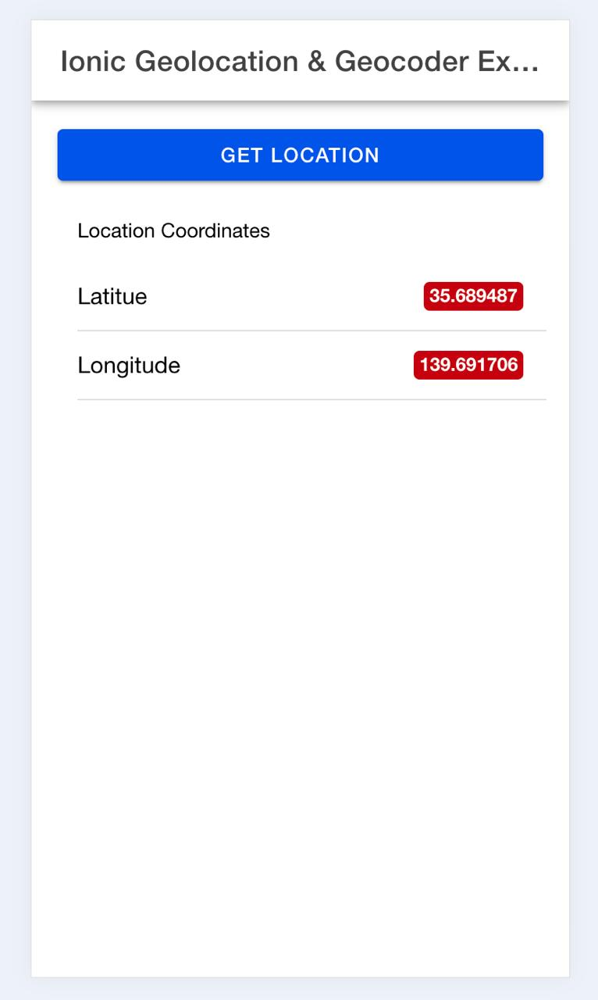
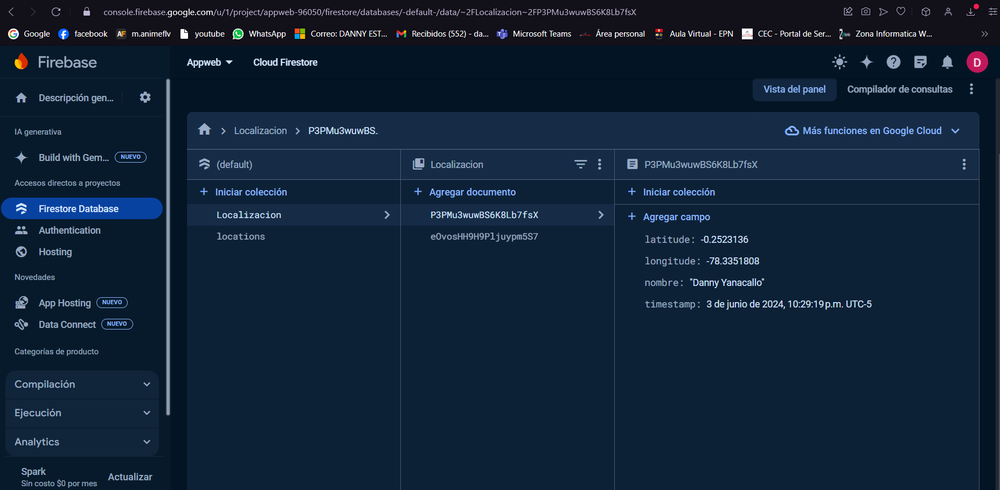

# 🌎🔥 GPS_Firebase

GPS con guardado de datos en firestore


## 💻 Tecnologías

**😀 Cliente:**
Ionic - Android - ReadME - Html - CSS - Javascript - Typescript

[](https://skillicons.dev)

**🖥️ Servidor:**
Angular - Firebase - NPM - Javascript - Typescript - Git - Capacitor

[](https://skillicons.dev)

## ⏬ Instalacion

Clona el proyecto

```bash
  git clone https://link-to-project
```

Ve a la carpeta del proyecto

```bash
  cd my-project
```

Instala las dependencias

```bash
  npm install
```

Inicia el servidor

```bash
  npx ng serve
```

## 🛑 ADVERTENCIA

Si no tienes ionic puedes instalarlo con el siguiente comando:

```bash
  npm install -g @ionic/cli
```

Recuerda la aplicacion se despliega en

```bash
  http://localhost:4200/
```

Todo esto es necesario para que pueda funcionar correctamente

## 🍃 Variables de Entorno

Para ejecutar este proyecto necesitaras dirijirte a archivo .env y colocar tus variables de entorno de la siguiente manera:

```js
  firebaseConfig :
  {
  apiKey: 'API_KEY',
  authDomain: 'DOMINIO',
  databaseURL: 'URL',
  projectId: 'ID',
  storageBucket: 'Storage',
  messagingSenderId: 'ID_Mensaje',
  appId: 'APP_ID',
  measurementId: 'ID_Medida'
  }
```

## 🖼️ Screenshots





## 👫 Autores

- [@bryandelgado99](https://github.com/bryandelgado99)


- [@Mino-Mateo](https://github.com/Mino-Mateo)


- [@natycasillas](https://github.com/natycasillas)


- [@DannyYanacallo1755](https://github.com/DannyYanacallo1755)


