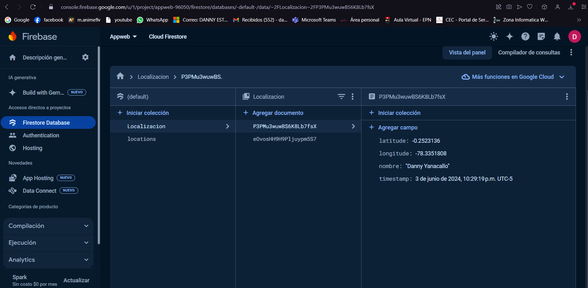
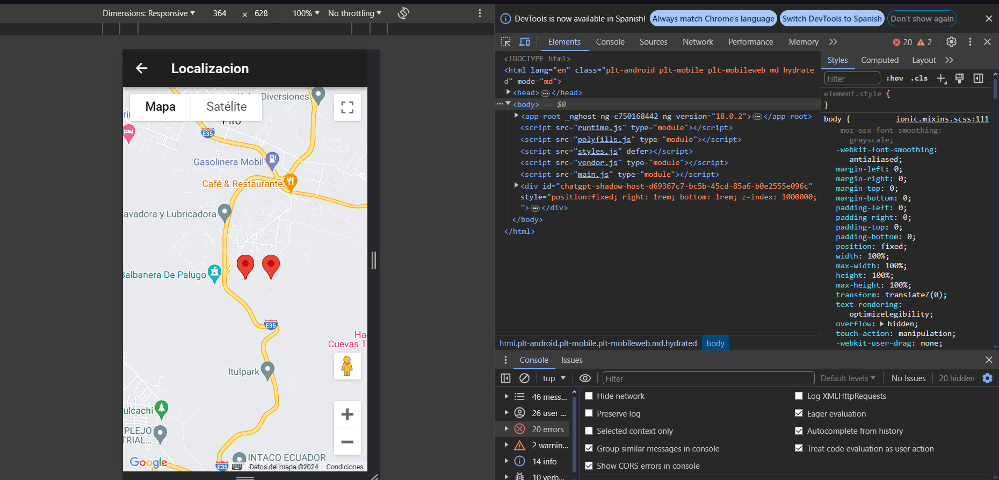

# 📦📱 GPS_Tiempo_Real


GPS con guardado de datos en real-time-database.

La aplicación web permite mostrar la ubicacion del usuario, junto con
una representacion en maps.


## 💻 Tecnologías

**😀 Cliente:**
Ionic - ReadME - Html - CSS - Javascript - Typescript - Android

[](https://skillicons.dev)

**🖥️ Servidor:**
Angular - Firebase - NPM - Javascript - Typescript - Git - Capacitor

[](https://skillicons.dev)

## ⏬ Instalacion

Clona el proyecto

```bash
  git clone https://link-to-project
```

Ve a la carpeta del proyecto

```bash
  cd my-project
```

Instala las dependencias

```bash
  npm install
```

Inicia el servidor

```bash
  npx ng serve
```

## 🛑 ADVERTENCIA

Si no tienes ionic puedes instalarlo con el siguiente comando:

```bash
  npm install -g @ionic/cli
```

Recuerda la aplicacion se despliega en

```bash
  http://localhost:4200/
```


Para que funcione el gps se debe añadir en la carpeta src, un index.html con este codigo

```bash
  <!DOCTYPE html>
<html lang="en">

<head>
  <meta charset="utf-8" />
  <title>Ionic App</title>

  <base href="/" />

  <meta name="color-scheme" content="light dark" />
  <meta name="viewport" content="viewport-fit=cover, width=device-width, initial-scale=1.0, minimum-scale=1.0, maximum-scale=1.0, user-scalable=no" />
  <meta name="format-detection" content="telephone=no" />
  <meta name="msapplication-tap-highlight" content="no" />

  <link rel="icon" type="image/png" href="assets/icon/favicon.png" />

  <!-- add to homescreen for ios -->
  <meta name="apple-mobile-web-app-capable" content="yes" />
  <meta name="apple-mobile-web-app-status-bar-style" content="black" />

   <!-- Google Maps API -->
   <script src="[Tu API]"></script>
</head>

<body>
  <app-root></app-root>
</body>

</html>
```

Y para finalizar debes ingresar una API conseguida en google cloud

Todo esto es necesario para que pueda funcionar correctamente

## 🖼️ Screenshots






## 📲 APK

[Descargar la última versión de la APK](https://github.com/bryandelgado99/Ionic-Projects/tree/main/GPS_Tiempo_Real/Recursos/maps_tiempo_real.apk)

## 👫 Autores

- [@bryandelgado99](https://github.com/bryandelgado99)


- [@Mino-Mateo](https://github.com/Mino-Mateo)


- [@natycasillas](https://github.com/natycasillas)


- [@DannyYanacallo1755](https://github.com/DannyYanacallo1755)


